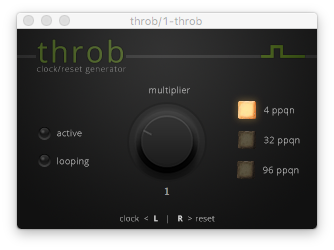

# throb #
 

Throb is a free [JUCE][0e888cf7] based plugin that generates clock/reset signals synchronised with the host tempo. It is currently available for **Windows** (VST2 and VST3, 32/64 bit) and **OS X** (VST2, VST3 and AU 32/64 bit).
The multiplier is an automation parameter and therefore can be controlled using the respective host functionality. Both the multiplier and the resolution (ppqn) settings are serialized to the preset chunk.

**WARNING**: do not send the output of this plugin to your speakers or headphones!

## Download ##

You can download the latest build from BinTray:
- OS X: 
- Windows 32bit: 
- Windows 64 bit: 

## Install ##
- To install on Windows: copy the **dll files** to you VST plugins folder
- To install on OS X:
  - copy **throb.components** to `/Library/Audio/Plug-Ins/Components/`
  - copy **throb.vst** to `/Library/Audio/Plug-Ins/VST/`
  - copy **throb.vst3** to `/Library/Audio/Plug-Ins/VST3/`

## Building on OS X ##
- Make sure cmake, git and Xcode are installed (if not, the first two can be installed via [brew][dbaaa0fa], while Xcode can be downloaded from the App Store)
- From the terminal, run:
  - `git clone https://github.com/shaduzlabs/throb.git`
  - `cd throb`
  - `git submodule update --init --recursive`
  - `mkdir build`
  - `cd build`
  - `cmake -DCMAKE_OSX_ARCHITECTURES="i386;x86_64" -G Xcode ..`
  - `cmake --build . --config Release`
  - Now you should have the following bundles:
    - `build/Release/throb.vst`
    - `build/Release/throb.vst3`
    - `build/Release/throb.component`

## Building on Windows ##
- Make sure cmake, git and Visual Studio 2015 are installed
- From the command prompt, run:
  - `git clone https://github.com/shaduzlabs/throb.git`
  - `cd throb`
  - `git submodule update --init --recursive`
  - `mkdir build`
  - `cd build`
  - `cmake -G "Visual Studio 14 2015 Win64" ..` to build the 64 bit version or `cmake -G "Visual Studio 14 2015" ..` to build the 32 bit version
  - `cmake --build . --config Release`
  - Now you should have the following bundles:
    - `build/Release/throb.dll`
    - `build/Release/throb.vst3`

  [0e888cf7]: https://www.juce.com "JUCE website"
  [7aae2e00]: https://dl.bintray.com/shaduzlabs/throb "download from BinTray"
  [dbaaa0fa]: https://brew.sh "Install brew"
